# SpeakSafe

**Anonymous legal support for victims of harassment and violence, powered by AI and verified jurists.**

SpeakSafe is an open, privacy-first platform that lets survivors share their situations anonymously, receive AI-generated legal guidance grounded in their country's criminal code, and connect with verified legal professionals — all without revealing their real identity.

---

## Problem Statement

Victims of domestic violence, workplace harassment, digital abuse, and public violence in francophone Africa face a compounding barrier: they cannot easily access legal guidance without risking identification, re-traumatization, or social stigma. Many do not know which laws protect them. Professional legal consultations are expensive and not always confidential.

SpeakSafe addresses this gap by:

- Giving victims a **fully anonymous voice** — only a chosen pseudonym is ever visible
- Delivering **country-specific legal guidance** grounded in real criminal codes via a RAG pipeline
- Connecting users with **verified jurists** who can comment with professional legal advice
- Enabling **private, end-to-end encrypted chat** between users and legal professionals

---

## Screenshots

### Onboarding & Authentication
<p align="center">
  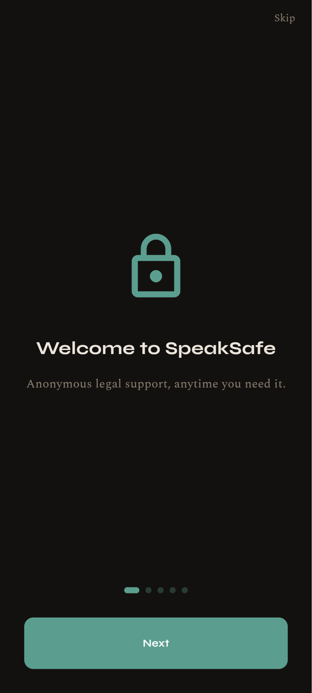
  
  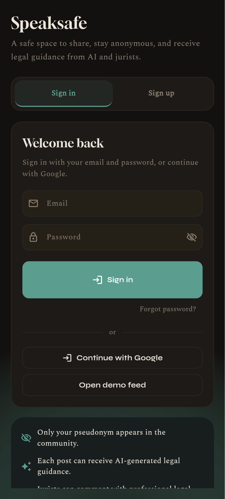
  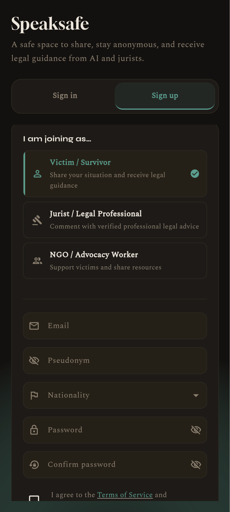
</p>

### Feed & Posts
<p align="center">
  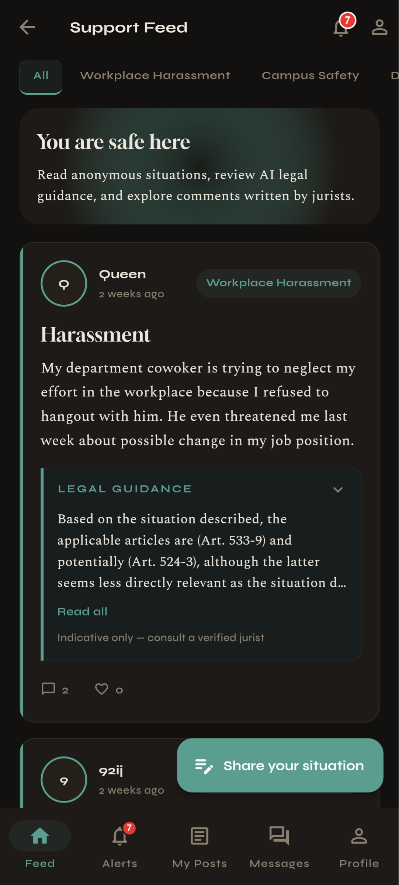
  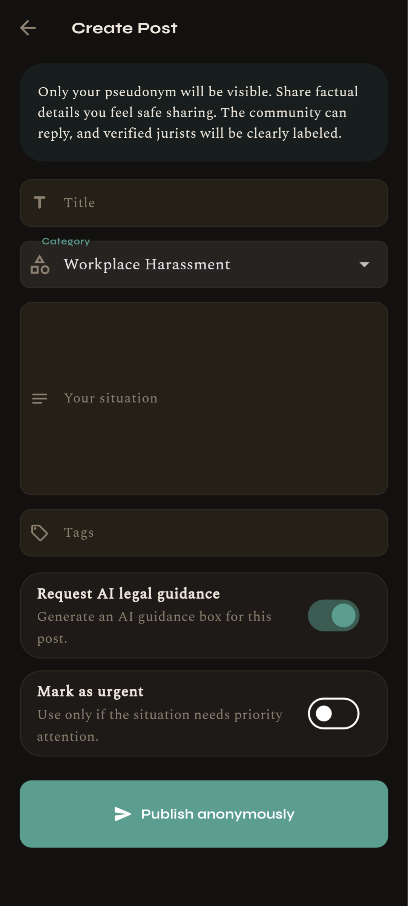
  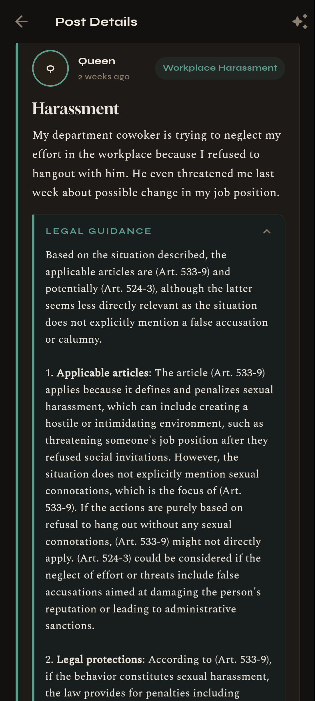
  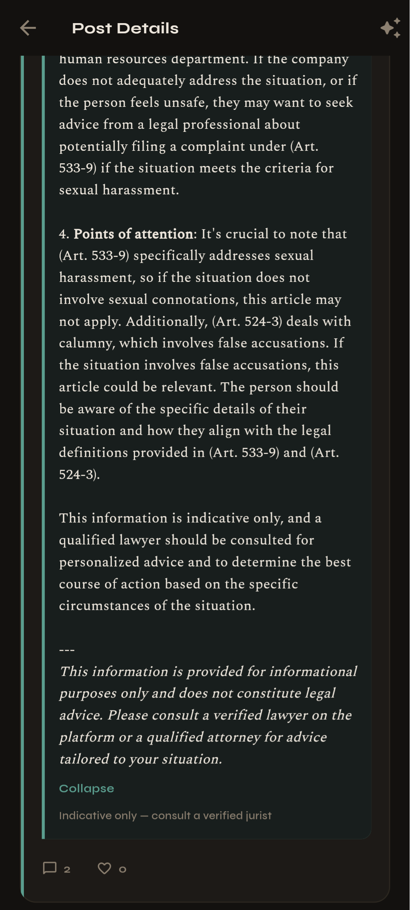
</p>


### Interactions & Profile
<p align="center">
  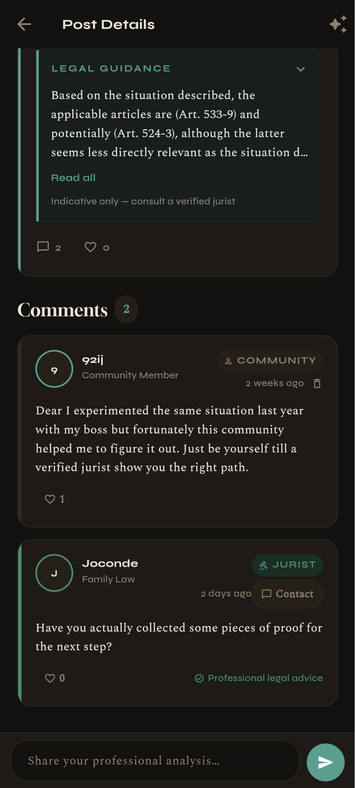
  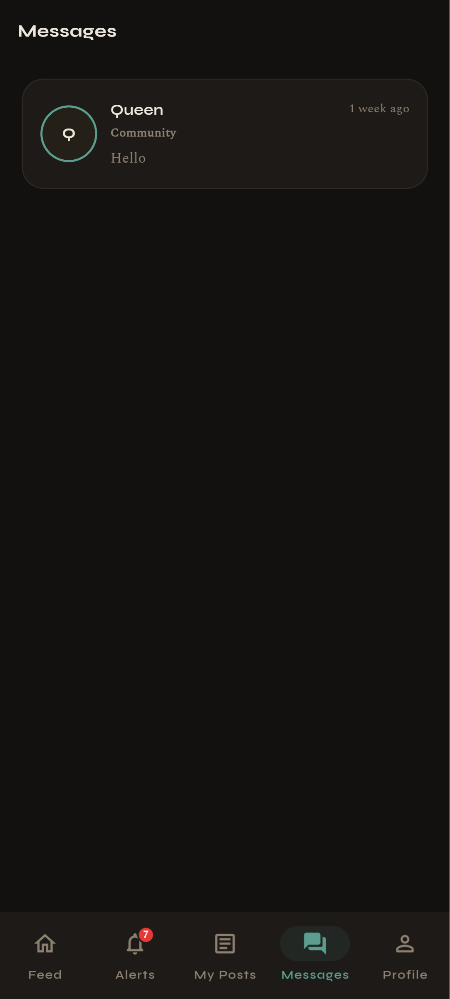
  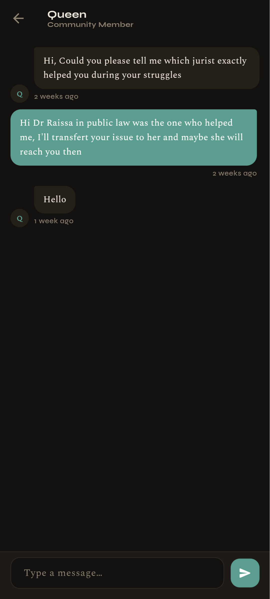
  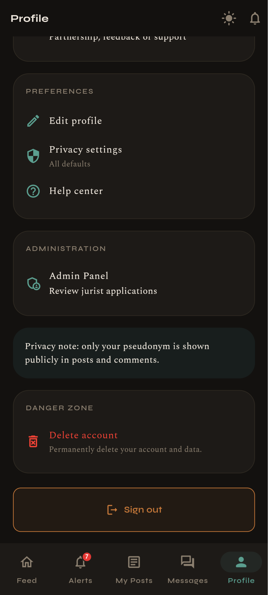
</p>

---

## Countries Covered

SpeakSafe currently ingests and serves legal guidance for **10 French-speaking African nations**:

| Country | Legal Source |
|---|---|
| 🇧🇫 Burkina Faso | Code Pénal du Burkina Faso |
| 🇸🇳 Senegal | Code Pénal du Sénégal |
| 🇨🇮 Côte d'Ivoire | Code Pénal de Côte d'Ivoire |
| 🇲🇱 Mali | Code Pénal du Mali |
| 🇳🇪 Niger | Code Pénal du Niger |
| 🇹🇬 Togo | Code Pénal du Togo |
| 🇧🇯 Benin | Code Pénal du Bénin |
| 🇨🇲 Cameroon | Code Pénal du Cameroun |
| 🇬🇳 Guinea | Code Pénal de Guinée |
| 🇹🇩 Chad | Code Pénal du Tchad |

---

## Technical Architecture
### AI generated image

<p align="center">
  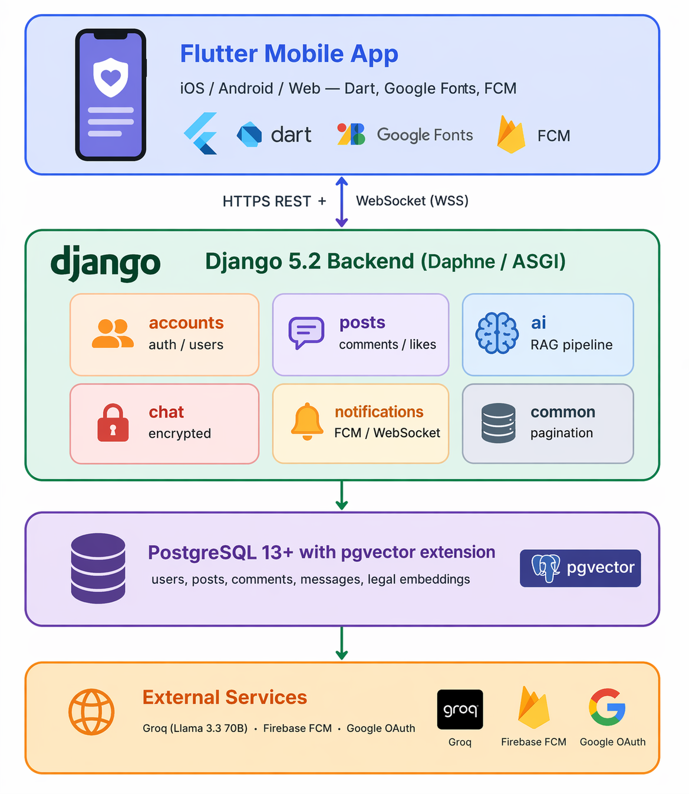
</p>

```

### Frontend — Flutter / Dart

The mobile and web client is built with **Flutter 3.10+** and targets Android, iOS, and Web from a single codebase.

**Key responsibilities:**
- Email/password and Google SSO authentication
- Anonymous post creation with category tagging and urgency flag
- Real-time feed with category filtering
- AI guidance display with expand/collapse
- Comment threads with professional jurist badges
- End-to-end encrypted 1-to-1 chat over WebSocket
- Push notifications via Firebase Cloud Messaging
- Country picker with 190+ countries for nationality field
- Light/dark theme with persisted preference

**Design system:** Warm editorial aesthetic — Gloock (display), Spectral (body), Syne (UI chrome), teal primary on a near-black dark background.

### Backend — Django / Python

The API server runs as an **ASGI application** (Daphne + Django Channels), handling both HTTP REST endpoints and WebSocket connections in the same process.

**Apps:**

| App | Responsibility |
|---|---|
| `accounts` | User model, Google OAuth verification, JWT auth, OTP email verification, profile management |
| `posts` | Post creation/editing, comment threading, polymorphic likes, rate limiting (2 posts/day) |
| `ai` | RAG pipeline: PDF ingestion, embedding generation, vector search, Groq LLM generation |
| `chat` | Conversation model, Fernet-encrypted messages, async WebSocket consumer |
| `notifications` | Notification types, Django signals, FCM push delivery, WebSocket real-time stream |
| `common` | Shared pagination, rate throttles |

**Custom User Model** replaces Django's default:
- `email` as the login field (no username)
- Fields: `pseudonym` (public), `nationality`, `role` (`victim` / `jurist` / `ngo`), `google_sub`, `is_jurist_verified`, `allow_messaging`, `anonymous_mode`

### Database — PostgreSQL + pgvector

PostgreSQL is the sole datastore. The **pgvector** extension adds:
- `VectorField(dimensions=384)` on `LegalChunk` for embedding storage
- HNSW index with cosine distance operator for fast approximate nearest-neighbour search

**Core tables:**

```
User            — identity, role, pseudonym, encrypted session
Post            — content, category, AI guidance status, urgency
Comment         — threaded replies, professional flag
Like            — polymorphic (post or comment)
Conversation    — two-user pairing with encrypted key
Message         — ciphertext stored, decrypted on read
LegalDocument   — country + metadata
LegalChunk      — article text + 384-dim embedding + section path
Notification    — type, recipient, isRead, payload
```

---

## RAG Pipeline

The AI legal guidance feature is the core innovation. When a user creates a post and requests AI guidance, the following pipeline runs:

```
Post content
    │
    ▼
1. Determine country
   └── author.nationality → mapped to country slug
       e.g. "sénégalais" → "senegal"
    │
    ▼
2. Build search query
   └── title + content[:500] + category keywords (French)
       e.g. "harcèlement travail employeur" for workplace_harassment
    │
    ▼
3. Generate query embedding
   └── sentence-transformers/paraphrase-multilingual-MiniLM-L12-v2
       Output: 384-dimensional float vector
       Multilingual: works on French, English, and 50+ languages
    │
    ▼
4. Vector search (pgvector)
   └── SELECT chunks WHERE country = ? 
       ORDER BY cosine_distance(embedding, query_vector)
       LIMIT 2 (top-k, distance threshold 0.6)
    │
    ▼
5. Build LLM prompt
   └── System: "You are a legal assistant for {country}. 
               Cite article numbers. Do not invent laws."
       User:   Post content + retrieved legal chunks with citations
    │
    ▼
6. Groq API — Llama 3.3 70B Versatile
   └── temperature=0.2, max_tokens=2048, top_p=0.8
    │
    ▼
7. Structured response
   └── Applicable articles → Protections → Recommended steps → Points of attention
       + mandatory disclaimer (not legal advice)
    │
    ▼
8. Notification to author
   └── "Your AI legal guidance is ready" (FCM + WebSocket)
```

**Embedding model:** `paraphrase-multilingual-MiniLM-L12-v2` — a compact (384-dim) multilingual sentence transformer. It runs on CPU without GPU acceleration, making it viable on constrained hosting. Loaded lazily and cached with `@lru_cache`.

**Fallback chain:**
1. No legal document for country → use first available country
2. No matching chunks → LLM generates response with "no articles found" disclosure
3. Groq API unavailable → return raw article text without LLM formatting
4. `AI_ENABLED=false` → PlaceholderRAGService returns category-based canned guidance (for memory-limited deployments)

### Legal Document Ingestion

PDF legal codes are ingested via a management command:

```bash
python manage.py ingest_legal_code \
    --file /path/to/code_penal.pdf \
    --country senegal \
    --title "Code Pénal du Sénégal" \
    --language fr
```

The ingestion pipeline:
1. **Parse PDF** with PyMuPDF — extract text page by page
2. **Identify articles** via regex (`Art. 12`, `Article 12`, etc.)
3. **Build hierarchy** — Livre → Titre → Chapitre → Section → Article for citation paths
4. **Chunk** — split at article boundaries, max 1 500 chars per chunk
5. **Embed** — batch encode with sentence-transformers (batch_size=64, with progress bar)
6. **Store** — atomic transaction: `LegalDocument` + bulk `LegalChunk` with embeddings

Each `LegalChunk` stores:
- `article_number` (e.g. `Art. 512`)
- `section_path` (e.g. `Livre II > Titre I > Chapitre 3`)
- `content` (raw legal text)
- `embedding` (384-dim vector, HNSW indexed)

---

## Privacy & Security

| Concern | Implementation |
|---|---|
| Anonymity | Only pseudonym shown publicly; email never exposed |
| Chat at rest | Fernet symmetric encryption per conversation; master key in env |
| Session tokens | JWT (60 min access / 7 day refresh) in SharedPreferences |
| Google auth | `idToken` verified server-side via `google.oauth2.id_token` |
| Rate limiting | 2 posts/day/user; 5 req/min on sensitive endpoints |
| Error tracking | Sentry with `send_default_pii=false` (no IPs or cookies) |
| Anonymous mode | User toggle — hides nationality from public posts |

---

## Tech Stack

### Frontend

| Layer | Technology |
|---|---|
| Framework | Flutter 3.10+, Dart |
| HTTP client | `http ^1.2.2` |
| Auth | `google_sign_in ^6.2.1` |
| Secure storage | `flutter_secure_storage ^9.2.2` |
| Persistence | `shared_preferences ^2.3.5` |
| Real-time | `web_socket_channel ^3.0.1` |
| Push notifications | `firebase_messaging ^15.1.3` |
| Error tracking | `sentry_flutter ^8.11.0` |
| Deep links | `app_links ^6.0.0` |
| Fonts | Gloock, Spectral, Syne (Google Fonts, bundled) |

### Backend

| Layer | Technology |
|---|---|
| Framework | Django 5.2, Python 3.12 |
| API | Django REST Framework 3.17.1 |
| Auth | `djangorestframework-simplejwt ^5.5.1` |
| Real-time | Django Channels 4.3.2 + Daphne 4.2.1 (ASGI) |
| Vector DB | pgvector 0.4.2 (PostgreSQL extension) |
| Embeddings | `sentence-transformers` — `paraphrase-multilingual-MiniLM-L12-v2` |
| LLM | Groq API — `llama-3.3-70b-versatile` |
| PDF parsing | PyMuPDF (fitz) |
| Encryption | `cryptography ^46.0.6` (Fernet) |
| Push notifications | `firebase-admin ^6.9.0` |
| Error tracking | `sentry-sdk ^2.29.1` |
| Database | PostgreSQL 13+ |

### Infrastructure

| Concern | Service |
|---|---|
| Backend hosting | Render (Daphne ASGI, Python 3.12) |
| Database | Render PostgreSQL |
| Push notifications | Firebase Cloud Messaging |
| LLM inference | Groq (14 400 req/day free tier) |
| Error monitoring | Sentry |

---

## User Roles

| Role | Capabilities |
|---|---|
| **Victim / Survivor** | Create posts (2/day), request AI guidance, comment, like, private chat |
| **NGO / Advocacy Worker** | Comment with NGO label, private chat |
| **Jurist / Legal Professional** | Comment with ⚖️ professional badge (once admin-verified), private chat |

Jurist accounts are reviewed by platform admins before professional commenting is enabled. All roles browse the feed immediately after sign-up.

---

## Post Categories

Posts are tagged with one of six categories that also inform the RAG search query:

- Workplace Harassment
- Campus Safety
- Digital Abuse
- Domestic Violence
- Public Harassment
- Other

---

## Real-Time Features

Both WebSocket consumers run over the same Daphne ASGI process:

**Chat (`ws/chat/`):**
- JWT-authenticated connection
- Messages broadcast to both conversation participants in real-time
- Unread count tracked server-side

**Notifications (`ws/notifications/`):**
- Per-user channel — events sent on comment, AI guidance ready, moderation action
- Unread badge count updated live in the Flutter app via `ChangeNotifier`
- FCM push also fires for background/killed app states

---

## Contributing

SpeakSafe is built for a mission: giving voice to survivors. Contributions that improve legal accuracy, accessibility, language coverage, or privacy are especially welcome.

---

## License

This project is provided for educational and humanitarian purposes. See `LICENSE` for details.

---

*SpeakSafe — because every survivor deserves to be heard.*
